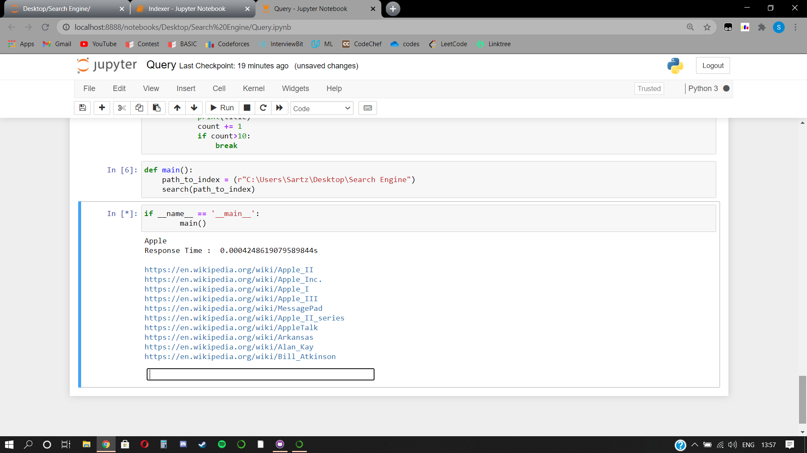

# Wikipedia Search Engine

wikipidea dump file link :
https://dumps.wikimedia.org/enwiki/latest/

### Prerequisites
1. Python3
2. nltk
3. etree
4. stop words list

  
### About Project
•Implemented a Wikipedia Search Engine in Python. Based on Information Retrieval, which uses k-way merge sort to handle over 75GB wiki-dump files. 
•Display search-results using page relevance ranking based on tf-idf scores.

### Following Steps Follows to create Inverted Indexes

* Parsing using etree : Need to parse each page , title tag, infobox, categorybox.
* Tokenization  : Tokenize sentense to get each token using regular expression
* Case Folding : make it all to lowercase
* Stop Words Removal : remove stop word which are more frequently occured in a sentences
* Stemming : Get root/base word and store it. Used Snowball Stemmer
* Inverted Index Creation : Create word & its positing list consist of doc_id : TF-IDf score along with its offset for constant time.

### Features

* support field query like title:abc body:aaa infobox:zyx
* showing only top 10 relevent search result 
* Response time is nearly 1-2 second

### Challenges 

1. Difficult to process such huge Data dump of 76 GB
2. Can not store word & its posting list into a main memory, So Used K-way Merge sort
3. Can not Load full final index into main memory, So Bild Secondary Index on top of Primary Index (Posting List)

<h3> Sample Result </h3>

